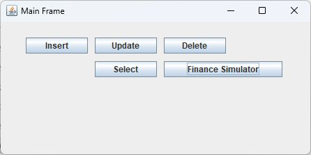
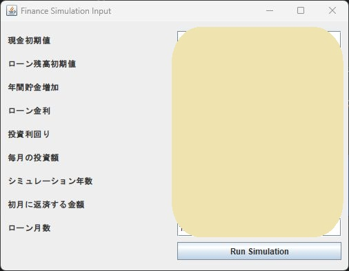
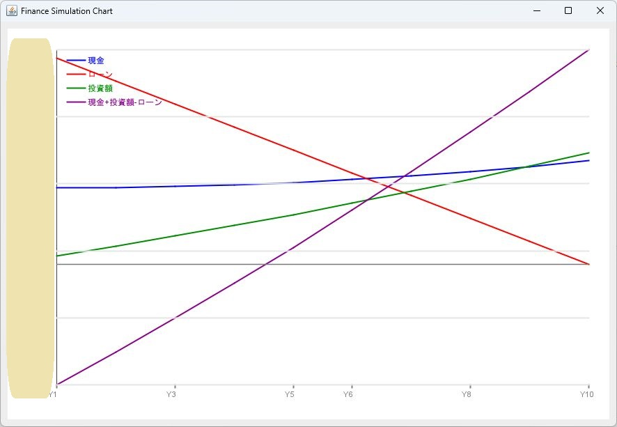

# 住宅ローンシミュレーションアプリ






# 環境構築
## DBセットアップ
1. MySQLをセットアップする。
ここでは、dockerにてコンテナイメージを作成する。
```
docker run --name mysql-crud -e MYSQL_ROOT_PASSWORD=rootpass -e MYSQL_DATABASE=swing_crud -e MYSQL_USER=swing -e MYSQL_PASSWORD=swingpass -p 3306:3306 -d mysql:8.0
```

2. MySQLのユーザー認証方式を`mysql_native_password`に変更する
```
docker exec -it mysql-crud mysql -u root -p

ALTER USER 'swing'@'%' 
IDENTIFIED WITH mysql_native_password 
BY 'swingpass';
```

3. MySQLのswing_crudデータベースにテーブルを作成する。
```
SHOW DATABASES;
USE swing_crud;
SHOW TABLES;

CREATE TABLE contact (
  id INT AUTO_INCREMENT PRIMARY KEY,
  name VARCHAR(100) NOT NULL,
  number VARCHAR(200)
);
```


# 参照
https://github.com/kotlintpoint/java_swing_mysql_crud

